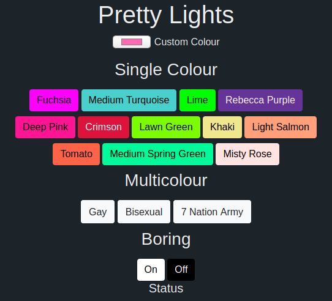

# pretty-lights

A toolkit for using and testing the addressable LED lights on the stairs.

Based on [localwood](https://github.com/The-Silverwood-Institute/Localwood), the smart socket control panel.
