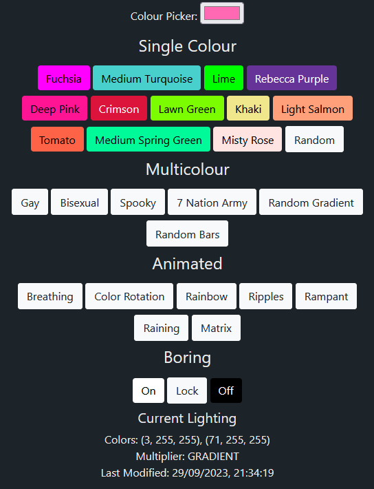

# pretty-lights

A toolkit for using and testing the addressable LED lights on the stairs. Here's [a video](https://photos.app.goo.gl/JnyYJmuoaqBnrmEx7) cycling through a few of the animations.

Based on [localwood](https://github.com/The-Silverwood-Institute/Localwood), the smart socket control panel.

Automate colour changes with cron:

`*/30 * * * * curl -X POST "localhost:8090/random?automated=1"`

Note: You can't change the frequency of automated colour changes faster than `SECONDS_TO_IDLE`
